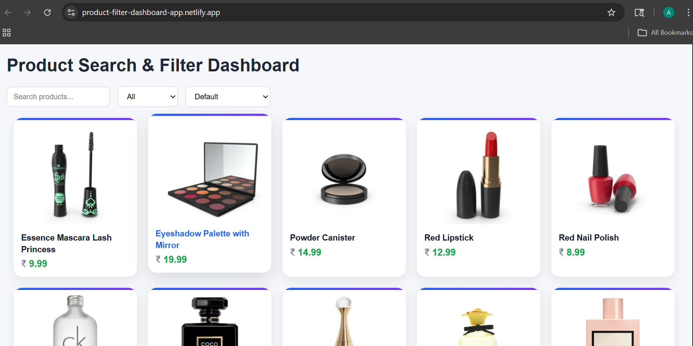
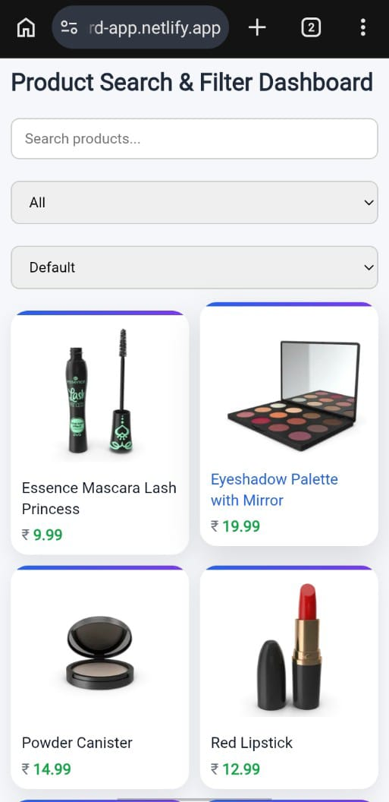

# 🔍 Product Search & Filter Dashboard (Vanilla JS)

A responsive product dashboard built using **Vanilla JavaScript** that demonstrates real-world features like search, filtering, sorting, and error handling.

---

## 🌐 Live Demo

👉 https://product-filter-dashboard-app.netlify.app/

---

## 🚀 Features

- 🔎 **Debounced Search** – optimized input handling for better performance
- 📂 **Category Filter** – dynamic dropdown generated from API data
- 🔃 **Sorting Options** – price low → high, high → low
- ⏳ **Loading State** – improved UX while fetching data
- ❌ **Error Handling** – graceful UI when API fails
- 🔁 **Retry Button** – allows users to retry failed requests
- 🧠 **Centralized State Management** – clean and maintainable logic

---

## 🛠️ Tech Stack

- HTML5
- CSS3
- Vanilla JavaScript (ES6 Modules)

---

## 🌐 API Used

- https://dummyjson.com/products

---

## 📁 Project Structure

search-filter-dashboard/
│
├── index.html
├── style.css
├── assets/
│   ├── desktop.png
│   └── mobile.jpeg
│
├── js/
│   ├── app.js
│   ├── api.js
│   ├── ui.js
│   └── debounce.js

---

## ⚙️ How It Works

1. App initializes and fetches product data from API
2. Data is stored in a central state (`allProducts`)
3. UI renders product cards dynamically
4. User interactions (search, filter, sort) update the state
5. `applyFilters()` processes data and updates the UI

---

## 🧠 Key Concepts Used

- Event-driven architecture
- Debouncing for performance optimization
- Separation of concerns (API / UI / Logic)
- Single source of truth for data
- Array methods (`map`, `filter`, `sort`)

---

## 🧪 Error Handling

- Displays error message when API request fails
- Provides a retry button to reload data

---

## 📚 What I Learned

- Handling asynchronous data with API calls
- Implementing debouncing for better performance
- Managing UI state efficiently
- Building responsive layouts using CSS Grid
- Structuring scalable frontend projects

---

## 📸 Screenshots

### 🖥 Desktop View

### 📱 Mobile View

## 

## 🚀 Getting Started

1. Clone the repository

git clone https://github.com/aniruddha-jadhav-15/search-filter-dashboard.git

2. Navigate to project folder

cd search-filter-dashboard

3. Open `index.html` in your browser

---

## 📌 Future Improvements

- Pagination / Load more functionality
- Enhanced UI (animations, better card design)
- Dark mode
- Convert project to React

---

## 🙌 Author

**Aniruddha Jadhav**

---

## ⭐ Support

If you like this project, consider giving it a star ⭐ on GitHub!
